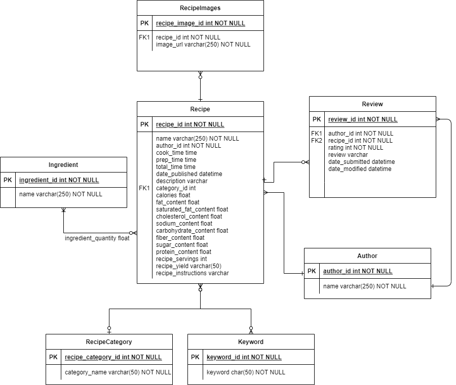
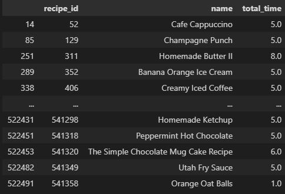
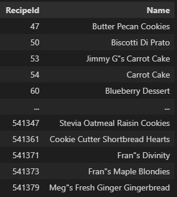
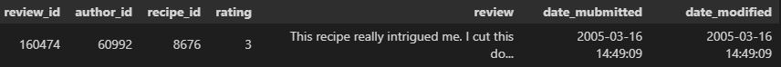

# Let's cook
Capstone project for Udacity Data Engineering nanodegree

## Scope 
In the project, I will build a data model that can be used as an app back-end. The app can be used to search for recipes given desired ingredients, time requirements, rating, etc.
The raw input data on recipes and ratings will be transformed into a relational data model that makes it possible to easily find recipes for different search criteria. 
The data is provided as two files (csv, parquet). The files are processed using Python as the dataset is small enough to be processed locally. The final data model is stored in an AWS Redshift database.
The data model visualization is created using draw.io.
For bigger datasets I would have used Spark for the data preparation. But as the dataset was small enough for processing it in Python, I chose the this option because it was easier to develop the code locally.

## Describe and Gather Data 
The data for this project comes from a Kaggle dataset that was created by scraping the recipes on food.com (https://www.kaggle.com/irkaal/foodcom-recipes-and-reviews). The recipes dataset contains 522,517 recipes from 312 different categories. This dataset provides information about each recipe like cooking times, servings, ingredients, nutrition, instructions, and more.
The reviews dataset contains 1,401,982 reviews from 271,907 different users. This dataset provides information about the author, rating, review text, and more.
The data was downloaded at the start of the project and is stored locally.

## Data Exploration
The data exploration is done in the Jupyter notebook EDA.ipynb. I checked for missing values which were not present in necessary columns. The columns where we have missing data are not deemed very important. That's why the missing values are kept.
I did not find any duplicate reviews or recipes. 
The timestamp columns were transformed into DateTime datatype. The columns for cook time, prep time and total time in the recipe dataset are parsed to transform them into floats representing the time in minutes.
The ingredients for the recipes were a bit problematic because the amount needed of the ingredients is stored in a separate column and the lengths of the arrays in the ingredient parts and quantities do not always match. Therefore, I decided to only keep the ingredients for which there are quantities.
## Data Model
The image below shows a visualisation of the target data model.

The data model is in 3rd normal form. This avoids redundancy and makes it easy to create flexible analyses, e.g. concerning the activity of authors.
By keeping the recipe categories and keywords in separate tables it is easy to rename a category or keyword and to edit the keywords for recipes. Moreover, the authors are stored in a separate table to make sure, that only one verson of the author name is mapped to an author id. In the original data, an author id could have different values for the author name in the recipe and review table when an author changed his name. 

### Data Dictionary
*recipes*

| Column | Data type | Constraint | Description | 
| ------ | --------- | ---------- | ----------- | 
| recipe_id | int | Primary key | unique id of a recipe |
| name | varchar(500) | | Name of the recipe |
| author_id | int | | unique id of the recipe author |
| cook_time | float | | Cook time in minutes |
| prep_time | float | | Preparation time in minutes |
| total_time | float | | Sum of cook and preparation time in minutes |
| date_published | datetime | | Date and time when the recipe was published | 
| description | str | | Description of the recipe |
| category_id | int | Foreign key (references categories.category_id) | unique id of the recipe category |
| calories | float | | Calories in kcal |
| fat_content | float | | Fat content in gram |
| saturated_fat_content | float | | Saturated fat content in gram | 
| cholesterol_content | float | | Cholesterol content in mg |
| sodium_content | float | | Sodium content in mg |
| carbohydrate_content | float | | Carbohydrate content in gram |
| fiber_content | float | | Fiber content in gram |
| sugar_content | float | | Sugar content in gram |
| protein_content | float | | Protein content in gram |
| recipe_servings | int | | Number of servings that result from preparing the recipe |
| recipe_yield | str | | Number of items that result from preparing the recipe |
| recipe_instructions | str | | Steps to prepare the recipe |
    
*recipe_images*

| Column | Data type | Constraint | Description | 
| ------ | --------- | ---------- | ----------- | 
| recipe_image_id | int | Primary key | Recipe image id |
| recipe_id | int | NOT NULL, Foreign key (references recipes.recipe_id) | recipe id |
| image_url | varchar | | URL to the image |

*ingredients*

| Column | Data type | Constraint | Description | 
| ------ | --------- | ---------- | ----------- | 
| ingredient_id | int | Primary key |  unique id of an ingredient |
| name | varchar(500) | | Name of the incredient |

*recipe_ingredients*

| Column | Data type | Constraint | Description | 
| ------ | --------- | ---------- | ----------- | 
| recipe_ingredient_id | int | Primary key | uniqe id for an ingredient-recipe id |
| ingredient_id | int | NOT NULL, Foreign key (references ingredients.ingredient_id) | unique id of an ingredient |
| recipe_id | int | NOT NULL, Foreign key (references recipes.recipe_id) | unique id of a recipe |
| ingredient_quantity | varchar(20) | | Quantity of the ingredient needed for the recipe |
  
*categories*

| Column | Data type | Constraint | Description | 
| ------ | --------- | ---------- | ----------- | 
| category_id | int | Primary key | unique id for the category |
| category_name | varhar(50) | | recipe category |

*keywords*

| Column | Data type | Constraint | Description | 
| ------ | --------- | ---------- | ----------- | 
| keyword_id | int | Unique id of the keyword |
| keyword | varchar(50) | NOT NULL | Keyword for the recipe type |

*reviews*

| Column | Data type | Constraint | Description | 
| ------ | --------- | ---------- | ----------- | 
| review_id | int | Primary key | Unique id for the review |
| author_id | int | NOT NULL, Foreign key (references authors.author_id) | Unique id of the author |
| recipe_id | int | NOT NULL, Foreign key (references recipes.recipe_id) | Unique id of the recipe |
| rating | int | NOT NULL | Rating between 1 (worst) and 5 (best) |
| review | varchar(max) | | Comment on the recipe |
| date_submitted | datetime | | Date and time when the review was first subitted |
| date_modified | datetime | | Date and time when the review was last modified |

*authors*

| Column | Data type | Constraint | Description | 
| ------ | --------- | ---------- | ----------- | 
| author_id | int | | Unique id for the author | 
| name | varchar(250) | NOT NULL | User name of the author |

*recipe_keywords*

| Column | Data type | Constraint | Description | 
| ------ | --------- | ---------- | ----------- | 
| recipe_keywords_id | int | Primary key | Id for the recipe and keyword id combination |
| recipe_id | int | NOT NULL, Foreign key (references recipes.recipe_id) | recipe id |
| keyword_id | int | NOT NULL, Foreign key (references keywords.keyword_id) | keyword |

### Steps taken to achieve the data model
First, I extract the unique authors from the both datasets and only keep the most current author name for each author id. These are stored in the authors table.
Second, the recipe categories are extracted from the recipe dataset. Each category is assigned an id. Only this category id is kept in the recipes table and I store the category id - name mapping in the categories table.
The recipe keywords are stored in an array in the original recipe dataset. The array is separated, each keyword is assigned a keyword id. A mapping table recipe_keywords holds the mapping between keywords and recipes.
Similarly, the recipe ingredients parts and quantities arrays in the recipe dataset are separated. The distinct ingredients are assigned an ingredient id. A mapping table recipe_ingredients holds the recipe id, ingredient id and the quantity of the ingredient needed for the recipe.
Also, the recipe images are extracted from the recipe dataset where they are stored in arrays and now are located in a separate recipe_images table. Now, it is easier to add or remove iages from a recipe.
In the reviews dataset I drop the author name as it can be loaded from the authors table. Other than that, nothing needs to be done before loading the dataset into the reviews table.

Integrity constraints on the relational database (e.g., unique key, data type, foreign keys) are added.

# Data quality
Unit tests ensure that the code runs without errors and that the number or rows in the database matches the input data.

# Possible usage
## Queries
Possible queries to make use of the data model could be
* Get the recipe_id, name and cook time for all recipes which take less than 10 minutes with 
  `SELECT recipe_id, name, cook_time FROM recipes WHERE total_time BETWEEN 1 AND 10`
  Result:
  
* Get all recipes in the category Dessert: 
  `SELECT recipe_id, name FROM recipes WHERE category_id IN (SELECT category_id FROM categories WHERE category_name = 'Dessert')`
  Result:
   
* Get all reviews for recipe name 'Super Coleslaw'
  `SELECT * FROM reviews WHERE recipe_id IN (SELECT recipe_id FROM recipes WHERE name="Super Coleslaw")`
  Result:
     

## Data update
The dataset is updated once a month. If I used the data model for a cooking website, I would update my database once every 5 minutes to show recent comments in the app but not overload the ETL pipeline. More frequent updates are not really necessary because I am not working with time critical data.
Updating the data in the database should be done using time partitions: Only the most recent new recipes and new comments should be processed.
## Ideas for different scenarios:
What should be done in case...
* *... the data was increased by 100x.* I would use Spark for the data preparation and store it in a Redshift database. 
* *... the pipelines were run on a daily basis by 7am.* I would use Airflow for scheduling the ETL job.
* *... the database needed to be accessed by 100+ people.* I would still load the data into an AWS Redshift database to be able to scale the accesses quickly and dynamically.

# Instructions
## Needed packages
To execute the code, you need to have Python3 installed as well as the following libraries:
* pandas
* psycopg2
* pathlib
* zipfile
* configparser

## Run the code
Before running the code, you need to download the files recipes.parquet.zip and reviews.csv.zip from
https://www.kaggle.com/irkaal/foodcom-recipes-and-reviews and store it in the data folder within the lets_cook directory.
Create a dwh.cfg based on the dwh_example.cfg that contains your AWS credentials.
Run the etl.py script to process the data and load the data model into AWS Redshift.
Run the cleanup.py script to delete the cluster.